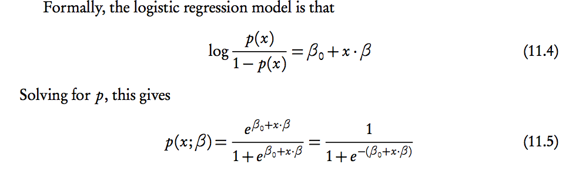

## Odds
In general, p(x) is the probability of x happening, q(x)=1-p(x) is the probability of x not happening. p can only be between 0 and 1.

Odds are another way of expressing probability. The equation connecting the two is odds(x) = p(x)/(1-p(x)).
So the left hand side of 11.4 is called the logodds (logarithm of the odds).

Here's an example.
If we say there are 3 to 2 odds of me winning a bet (3:2), the odds would be 3/2, or 1.5. Odds is a single number that can go from 0 to infinity (1:1000 is small odds, 1000:1 is big odds).

In terms of *probability*, 3:2 odds means there is a 3/5 chance of me winning (p(x)=3/5) and a 2/5 probability of me losing. If you plug it into the odds equation, you can see that the relationship works.

## Log Odds 

Where linear regression tries to figure out the Betas that cause y= B_0 + B_1 * x_1 + B_2 * x_2 +...   to be true,
Logistic regression tries to figure out the Betas such that equation 11.4 is true.

So, in linear regression, a Beta_1 of 1.6 means that for every increase in x_1 by 1, we predict that y will increase by 1.6.
In logistic regression Beta_1 of 1.6 would mean every increase in x_1 by 1 increases the *log odds* of an event happening by 1.6.

If you apply the exponential to both sides of eq. 11.4, you get  odds=e^(B_0 + B_1 * x_1 ...). This shows the direct relationship between odds and the Betas.  

Example:
If there is only one term total (say, height), and the beta coefficient is 2, then an increase in height from 0 to 5 would change the odds from odds=e^(2*0)=1, to odds=e^(2*5)= 22026.  That's a pretty big change, **BUT**
it's important to notice that it depends on the starting point. A change from 5 to 10 cm will change the odds in a different way than the change from 0 to 5.

You have to do a bit of math to find out what that means in terms of an increase in probability of an event happening.

## Solve for p(x)

Equation 11.5 shows the direct relationship between coefficients and changes in probability which is much more intuitive to think about than odds. You can try the same example we tried above. with height = 0, p=.5, h=5 gives us p= .99995460213.

The high level understanding of what logistic regression is doing comes in here. If you want to predict the probability that I'm male based on height, say. probabilities below 0 or above 1 make no sense. If we tried to model probability with a linear regression (p(x) = B*x), there is no way to make sure that increasing height doesn't spit back a predicted probability above 1, which would be nonsense.

Here's a graph of 11.5 (called a sigmoid):

 By looking for a linear relationship in the log odds instead of the probability, we ensure that when we map that back to probability, it will always fall between 0 and 1. A by-product of this is that odds and probabilities don't change linearly when you change an input ('height'). Asking how much a change in height of 5 changes odds or probabilities doesn't make sense because changing from 0 to 5 is different then changing from 5 to 10. You have to be specific.
 
 
 Notice that p changed from .5 to p= .99995460213 when h changed from 0 to 5, but a change from 5 to 10 will have almost no effect on the probability (it becomes 0.99999999793). Looking at the graph, once you get near .01 or .99 probability, you can increase the odds all you want but probability won't every go above 1.

